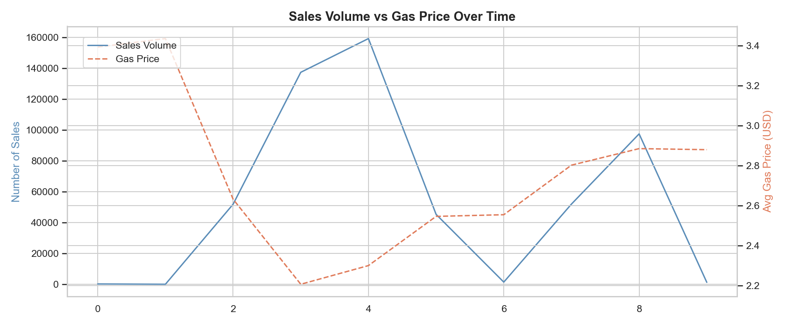

# Automobile Seasonal Demand Analysis


> Analysing 545,000+ vehicle sales records to uncover seasonal demand patterns in the automobile industry — built with Python and Plotly.

---

## Project Summary

This end-to-end data analysis project integrates vehicle sales data with fuel prices and weather data to deliver actionable business insights for automotive inventory and marketing strategy.

| Metric | Value |
|--------|-------|
| Total vehicles analysed | 545,604 |
| Date range | 2014 – 2015 |
| Average selling price | $13,734 |
| Peak season | Winter |
| Top vehicle type | Sedan |

---

## Key Insights

- **Winter is peak season** — 348,409 vehicles sold, driven by year-end dealer clearances, tax decisions, and holiday promotions
- **Sedan dominates** — 48.5% of all sales across every season
- **SUV is second** — 28.9% share, strong across all seasons
- **Gas prices inversely correlate with sales volume** — when fuel prices dropped in 2015, overall sales volume increased sharply
- **Spring has lowest sales** — best time for clearance promotions

---

## Tech Stack

| Tool | Purpose |
|------|---------|
| Python 3.10 | Core language |
| Pandas | Data cleaning and merging |
| Matplotlib / Seaborn | Exploratory data analysis charts |
| Plotly | Interactive dashboard |
| Jupyter Notebooks | Step-by-step workflow |
| Git | Version control |

---

## Project Structure
```
automobile-seasonal-analysis/
│
├── notebooks/
│   ├── 01_data_cleaning.ipynb
│   ├── 02_eda.ipynb
│   ├── 03_dashboard.ipynb
│   ├── 04_final_dashboard.ipynb
│   └── 05_report.ipynb
│
├── outputs/
│   ├── charts/
│   └── reports/
│
├── dashboards/
│   └── automobile_dashboard.html
│
├── README.md
└── requirements.txt
```

---

## Data Sources

| Dataset | Source |
|---------|--------|
| Vehicle Sales | Kaggle — Vehicle Sales Data |
| Fuel Prices | EIA — US Gasoline Retail Prices |
| Weather | Kaggle — Historical Hourly Weather |

> Raw data files are not included due to size. Download from links above and place in `data/raw/`

---

## How to Run
```bash
git clone https://github.com/Abhiram99099/automobile-seasonal-analysis
cd automobile-seasonal-analysis
python3 -m venv venv
source venv/bin/activate
pip install -r requirements.txt
jupyter notebook
```

Open notebooks in order: 01 → 02 → 03 → 04 → 05

---

## Dashboard

The interactive dashboard includes:
- 4 KPI cards — total sales, avg price, peak season, top vehicle type
- Sales volume by season
- Average price by season
- Gas price vs sales volume over time
- Vehicle type breakdown

Open `dashboards/automobile_dashboard.html` in any browser.

---

## Screenshots

### Overview


### Vehicle Type Breakdown


### Gas Price vs Sales


---

## Recommendations

1. Stock more sedans before winter — highest demand period
2. Peak marketing in Oct–Nov to capture winter buying surge
3. Promote fuel-efficient vehicles when gas prices rise
4. Run clearance promotions in Spring — lowest sales season

---

## Resume Bullet

> Developed a seasonal demand analytics project for the automobile industry by integrating 545K+ sales records with fuel and weather data using Python and Plotly, delivering actionable insights for inventory and marketing strategy.

---

*Built by Abhiram N — 2024*
